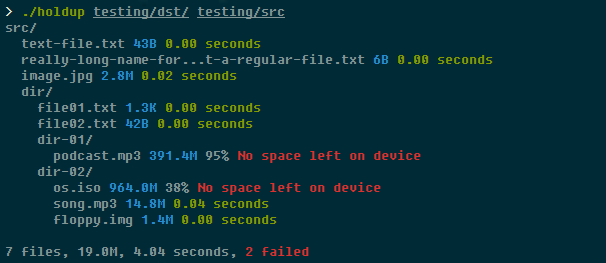

# holdup

*A simple backup utility* - ***use at your own risk!***

## Description

This utility copies all files and folders from one or more source directories to one destination directory. Ideally the destination should be on another physical drive.

A source file is copied if:
- the source file doesn't exist in the destination directory; or
- the source file does exist in the destination directory, but the source file has been modified since.

## Compiling

`make` will compile the utility and `sudo make install` will copy it to `usr/local/bin` (which should be in your `PATH`).

Alternatively: `make && sudo make install && make clean`.

## Usage

`holdup DESTINATION SOURCE...`

`SOURCE` directories will be copied to `DESTINATION`.
